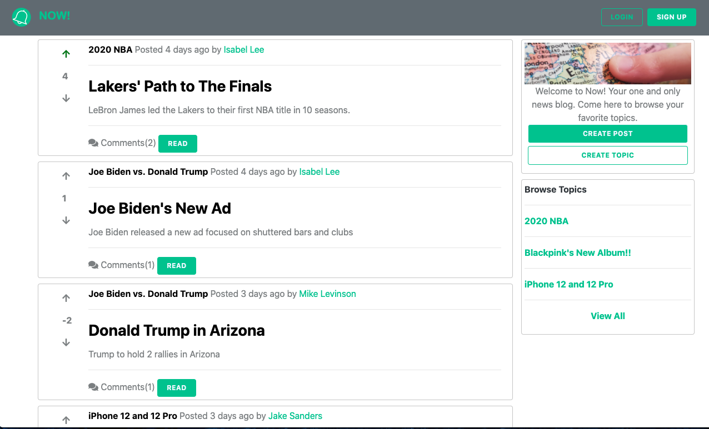
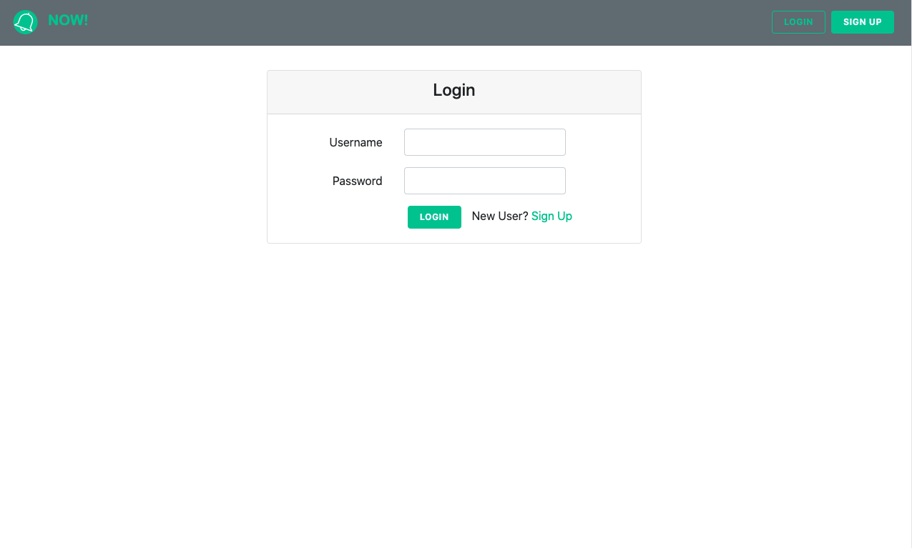
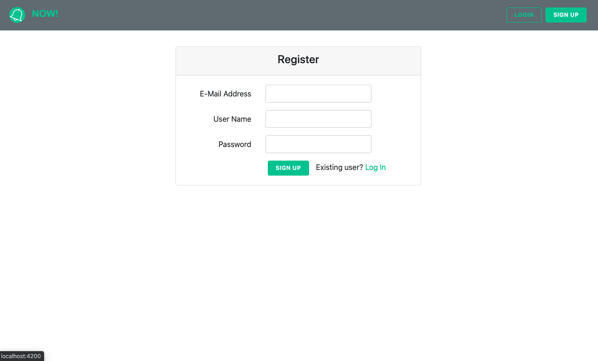
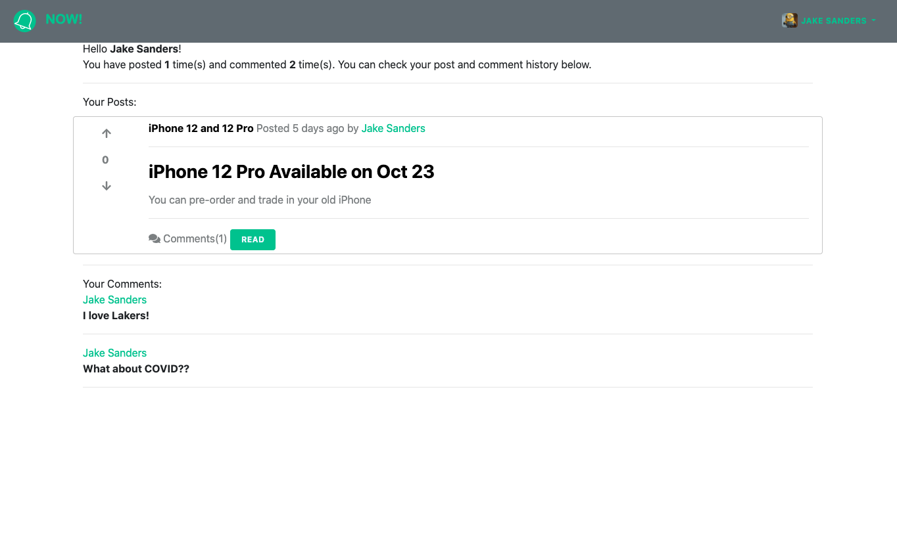
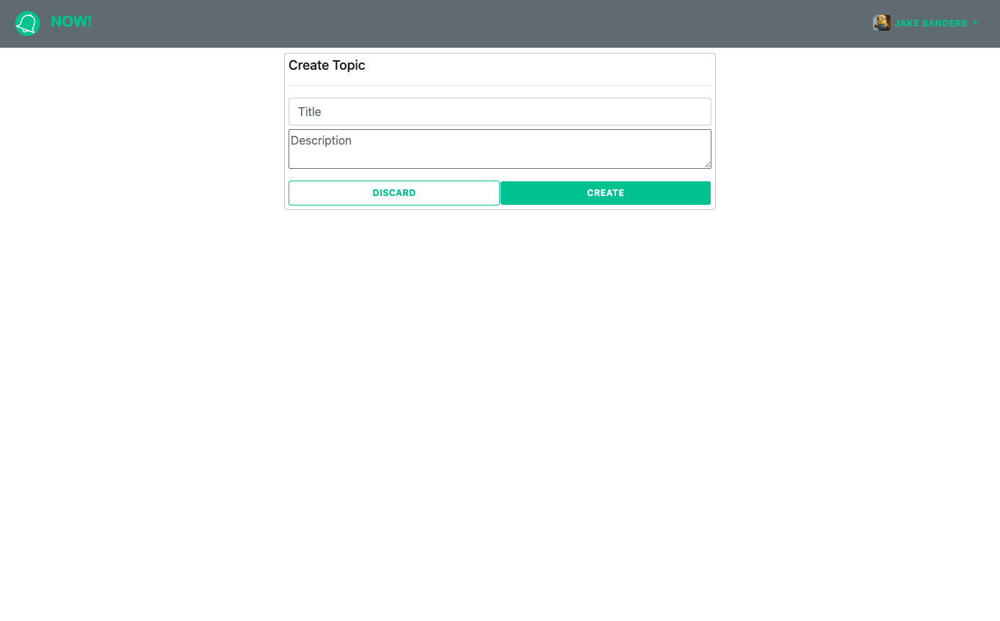
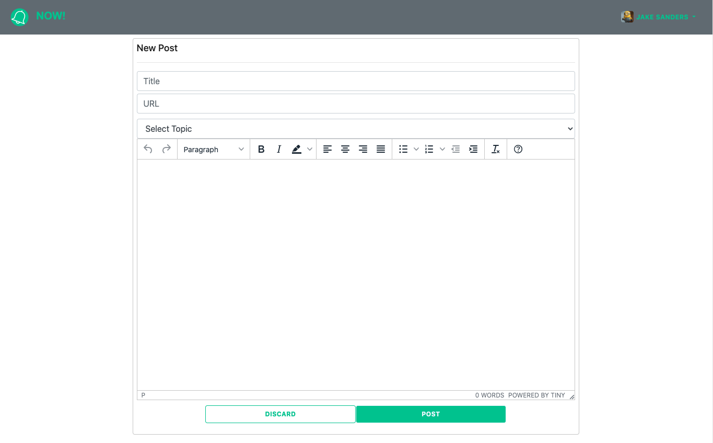
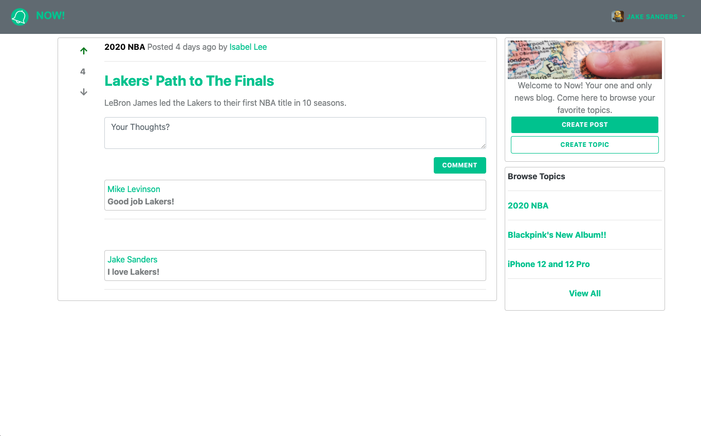
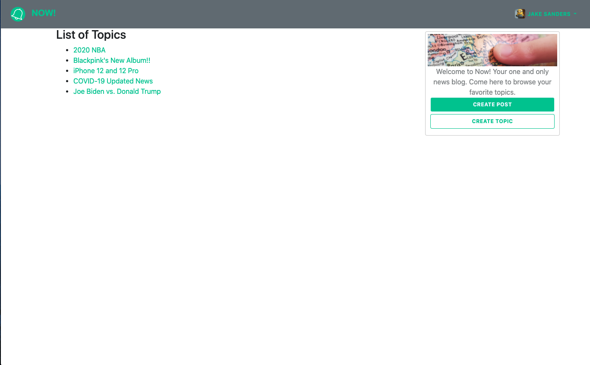

# "Now!" News Blog
"Now!" is a full-stack web application for news sharing that allows users to create posts, comment and vote on posts. The back-end is built using Spring MVC, Spring Security with JWT Authentication, Spring Data JPA and MySQL. The front-end is developed using Angular and Bootstrap.

## Screenshots
Home Page

Login Page

Signup Page

User Profile Page

Create Topic Page

Create Post Page

Comment Page

List of Topics Page

